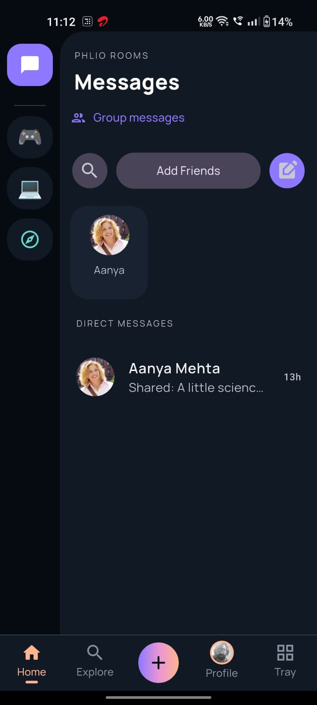
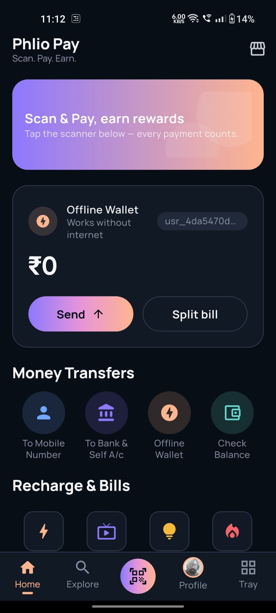
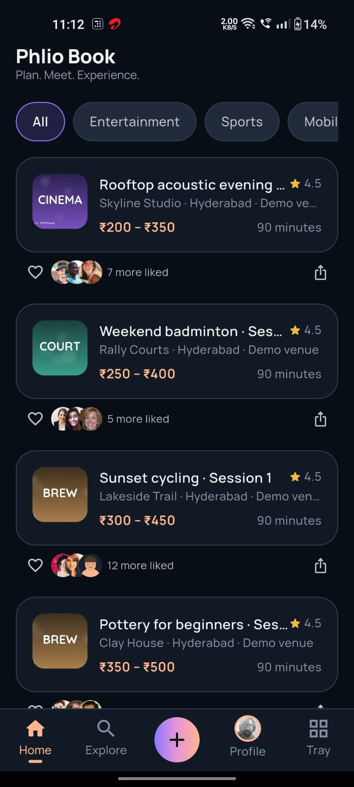
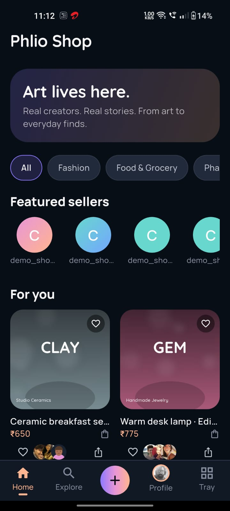
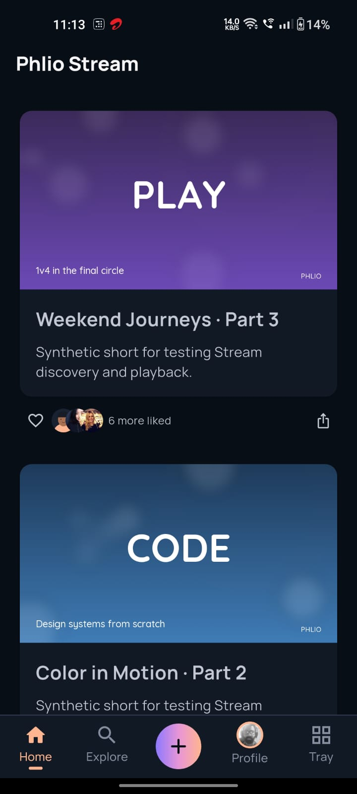
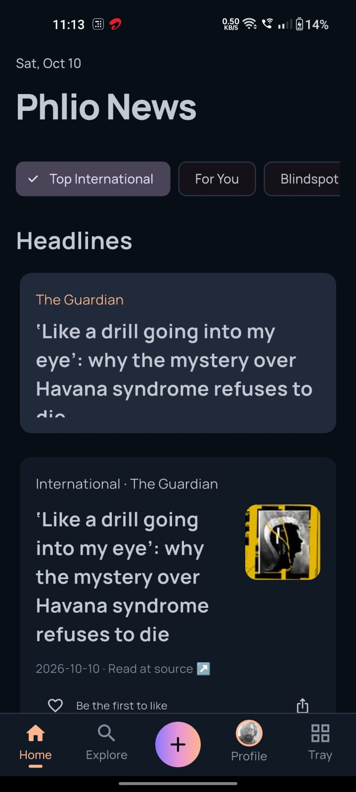
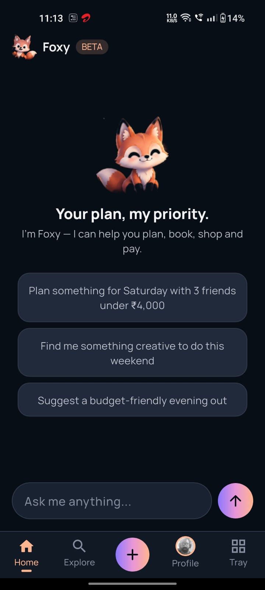

# Phlio

**People. Places. Possibilities.**

Phlio is a modular super-app: one identity, eight domains (Pay, Social,
Rooms, Book, Shop, Stream, News, and the Agent that ties them together).
This repository is the production-architecture scaffold, built in stages
per [`docs/architecture/phlio_blueprint_v2.md`](docs/architecture/phlio_blueprint_v2.md)
— the authoritative architecture reference — starting with a real, working
foundation rather than a mockup.

This build stage implements: **Home, Authentication, Phlio Social, Phlio
Rooms, Phlio Shop (Art & Handmade category), and the Phlio Agent** — end
to end, across all three layers of the stack. Pay, Book, Stream, and News
are intentionally out of scope for now; see [Roadmap](#roadmap). An
earlier architecture draft is kept at
[`docs/architecture/phlio_architecture_v1.md`](docs/architecture/phlio_architecture_v1.md)
for history — it is superseded by the v2 blueprint in every place the two
disagree (most notably: **there is no separate top-level Art domain** —
Art & Handmade is a Shop category).

## Stack

| Layer | Technology | Location |
|---|---|---|
| Frontend | Flutter (Dart), Riverpod, go_router, Clean Architecture | `frontend/ui/` |
| Backend | Python 3.12, FastAPI, `uv`, domain-oriented modular monolith | `backend/` |
| Core engine | Rust — crypto, ID generation, rule-based risk scoring | `phlio_core/` |
| Database | SurrealDB (production) / in-memory (zero-setup default) | `backend/app/infrastructure/database/` |

## Repository structure

```
phlio/
├── phlio_core/           Rust workspace: crypto, risk scoring, and a CLI
│                         the backend shells out to (see cli/src/main.rs)
├── backend/              FastAPI service — identity, social, rooms, shop,
│                         agent, home; clean/domain architecture
├── frontend/ui/          Flutter client — feature-first Clean Architecture
├── docker-compose.yml    Backend (+ optional SurrealDB/Redis) via Docker
├── Makefile              `make help` for every common command
└── docs/architecture/    Architecture reference docs (v2 is authoritative)
```

---

## Quickstart — three ways to run this

### 1. Docker Compose (fastest, no local toolchains needed)

```bash
docker compose up --build
```

This builds the Rust engine and the Python backend together (see
`backend/Dockerfile`) and starts the API at **http://localhost:8000**,
using the in-memory database — no extra services required. Open
**http://localhost:8000/docs** for interactive API docs.

Want the SurrealDB-backed production path instead of in-memory storage?

```bash
docker compose --profile full up --build
```

This additionally starts `surrealdb` (on `localhost:8001`) and `redis`,
and switches `DATABASE_BACKEND` to `surreal`. Because the backend connects
to SurrealDB eagerly at startup, a cold start can occasionally race SurrealDB
coming up — if the backend container exits, just run
`docker compose --profile full restart backend`.

Stop everything with `docker compose --profile full down` (or plain
`docker compose down` if you used the default profile).

### 2. Run the backend with `uvicorn` directly (Python 3.12 + `uv`)

```bash
cd backend
uv sync                 # installs dependencies into backend/.venv
uv run uvicorn app.main:app --host 0.0.0.0 --port 8000
```

That's it — `DATABASE_BACKEND=memory` is the default, so the API starts
seeded with demo data (users, rooms, shop products, posts) and no external
database to configure. Open **http://localhost:8000/docs**.

To also build the Rust core engine so the backend uses it instead of its
Python fallback (optional — everything works either way):

```bash
cd phlio_core && cargo build --release
```

The backend looks for the compiled binary at
`../phlio_core/target/release/phlio-core` relative to `backend/` by
default (`app/config.py`'s `core_engine_binary_path`).

Run the test suite:

```bash
cd backend && uv run pytest -v      # 36 tests
cd backend && uv run ruff check .   # linting
```

See [`backend/README.md`](backend/README.md) and `backend/.env.example`
for configuration details (JWT secret, SurrealDB connection, logging, and
the optional `ANTHROPIC_API_KEY` for the Phlio Agent's LLM-backed planner).

### 3. Run the Flutter app

```bash
cd frontend/ui
flutter pub get
flutter run
```

By default the app talks to `http://localhost:8000/api/v1`. Point it
somewhere else at run time with `--dart-define` — see
[`frontend/ui/.env.example`](frontend/ui/.env.example) for
every available flag:

```bash
# Android emulator (10.0.2.2 reaches the host machine's localhost)
flutter run --dart-define=API_BASE_URL=http://10.0.2.2:8000/api/v1

# For Actual Android device 
flutter run --dart-define=API_BASE_URL=http://192.168.1.6:8000/api/v1
```

Run its test suite with `flutter test` (see
[`frontend/ui/test/README.md`](frontend/ui/test/README.md)).

**Note on this sandbox:** this project was scaffolded in an environment
without network access to `pub.dev`, so `flutter pub get`/`flutter test`
could not be run or verified here — every dependency in `pubspec.yaml` is
a well-known, actively maintained package, and every test's constructor
calls were cross-checked by hand against the real signatures, but you
should run `flutter pub get`, `flutter analyze`, and `flutter test` as
your first steps locally.

### Or, all at once

```bash
make dev        # builds the Rust engine, installs backend deps, runs uvicorn
```

then in a second terminal: `make frontend-run`. Run `make help` for every
available command.

---

## What's implemented

- **Auth** — register/login/refresh with JWT (access + refresh tokens),
  bcrypt password hashing, session persistence via `flutter_secure_storage`
  with transparent token refresh on the client.
- **Home** — a cross-domain overview endpoint (`GET /api/v1/home/overview`)
  whose quick-actions grid is exactly Phlio's eight domains
  (Pay/Social/Rooms/Book/Shop/Stream/News/Agent), honestly marked
  available or roadmap — see `backend/app/domains/home/service.py`.
- **Phlio Social** — a feed with posts, likes, and comments, cursor-paginated.
- **Phlio Rooms** — community discovery by category, joining, and
  channel-style messaging.
- **Phlio Shop** — a general marketplace model (`Product`/`Seller`,
  13 categories per the blueprint) currently stocked with the **Art &
  Handmade** category, matching the reference screens' "Phlio Art" look
  while the domain underneath is the general Shop shape from day one.
- **Phlio Agent** — a planning assistant that calls real, deterministic
  tools across Rooms/Shop/Social to assemble a plan (see
  `backend/app/domains/agent/`). Works with zero configuration via a
  rule-based planner; set `ANTHROPIC_API_KEY` to have Claude write warmer
  plan summaries (the *contents* of a plan always come from the
  deterministic tool layer — the agent cannot invent items or authorize
  a transaction on its own, see that module's docstrings).
- **Rust core engine** — HMAC signing/verification, secure ID generation,
  and rule-based risk scoring, invoked by the backend as a local subprocess
  with an equivalent pure-Python fallback so the app runs identically with
  or without the compiled binary.
- **Two storage backends** — a seeded in-memory implementation (default,
  zero setup) and a parallel SurrealDB-shaped implementation behind the
  exact same repository interfaces, so switching backends is a one-line
  config change (`DATABASE_BACKEND=surreal`) that never touches domain or
  API code.
- **Structured logging, all three languages** — the backend emits
  request-ID-tagged, JSON-or-text structured logs (`LOG_FORMAT`/`LOG_LEVEL`
  in `.env`); the Rust CLI logs to stderr via `env_logger`/`RUST_LOG`,
  keeping stdout's JSON contract clean; the Flutter client has a small
  `dart:developer`-based logger wired into its API client. See each
  layer's README for specifics.
- **Animations** — a deliberate fade+rise page transition for top-level
  navigation, hand-built shimmer loading skeletons, a choreographed splash
  entrance, an animated bottom-nav indicator, and a `Hero`-animated,
  elastic favorite-heart toggle in Shop. See
  `frontend/ui/README.md`'s Animations section for the full list.


---

## Product & Design Preview

Phlio is designed as a family of specialized products connected by four shared
primitives: the **Social Graph**, **Phlio Objects**, **Phlio Notes**, and **Foxy**
(the Phlio Agent). The screens below capture the evolving product and UX direction
for each platform.

> **Design status:** These are product/design references, not a claim that every
> screen is implemented. For the current working scope, see
> [What's implemented](#whats-implemented) and [Roadmap](#roadmap).

<table>
  <tr>
    <td align="center">
      <strong>Phlio Social</strong><br><br>
      
    </td>
    <td align="center">
      <strong>Phlio Rooms</strong><br><br>
      
    </td>
    <td align="center">
      <strong>Phlio Pay</strong><br><br>
      
    </td>
  </tr>
  <tr>
    <td align="center">
      <strong>Phlio Book</strong><br><br>
      
    </td>
    <td align="center">
      <strong>Phlio Shop</strong><br><br>
      
    </td>
    <td align="center">
      <strong>Phlio Stream</strong><br><br>
      
    </td>
  </tr>
  <tr>
    <td align="center">
      <strong>Phlio News</strong><br><br>
      
    </td>
    <td align="center">
      <strong>Foxy — Phlio Agent</strong><br><br>
      
    </td>
    <td align="center">
      <strong>More to come</strong><br><br>
      Phlio continues to evolve across its connected product ecosystem.
    </td>
  </tr>
</table>

### Cross-platform product model

```text
Phlio
├── Pay
├── Social
├── Rooms
├── Book
├── Shop
├── Stream
├── News
└── Foxy / Agent

Shared across the ecosystem
├── Social Graph
├── Phlio Objects
├── Phlio Notes
└── Foxy
```

Each platform is intended to remain a deep product in its own right. The shared
primitives provide continuity of identity, relationships, context, intentional
sharing, and AI-assisted actions without reducing the ecosystem to a collection
of unrelated mini-apps.

---

## Roadmap

Out of scope for this build stage, called out explicitly rather than
silently half-built: **Pay, Book, Stream, News** (the four domains still
marked `is_available: false` on the Home grid), real-time room messaging
(currently poll/refresh-based, not WebSocket), push notifications, and the
Activity feed (the Flutter app has an honest placeholder for it — see
`frontend/ui/lib/app/shell/activity_placeholder_screen.dart`).
Shop categories beyond Art & Handmade are modeled but unseeded — adding a
second category is a seed-data change, not an architecture change.

## Updating this project

- **Backend**: add a new domain the same way `social`/`rooms`/`shop` are
  structured — `entities.py` + `repository.py` (interface) + `service.py`
  in `app/domains/<name>/`, an in-memory repo in
  `app/infrastructure/database/memory/`, routes in `app/api/v1/`, and wire
  it into `app/core/container.py`. Use `logging.getLogger("phlio.<name>")`
  for consistency with the rest of the backend.
- **Frontend**: add a new feature under `lib/features/<name>/` following
  the same `domain/` → `data/` → `presentation/` layering as the existing
  features, register its repository in `lib/core/di/service_locator.dart`,
  and add its routes to `lib/app/router/app_router.dart`.
- **Rust core**: add a new crate under `phlio_core/crates/`, add it to the
  workspace in `phlio_core/Cargo.toml`, and expose it through a new
  subcommand in `phlio_core/cli/src/main.rs` if the backend needs to call it.
